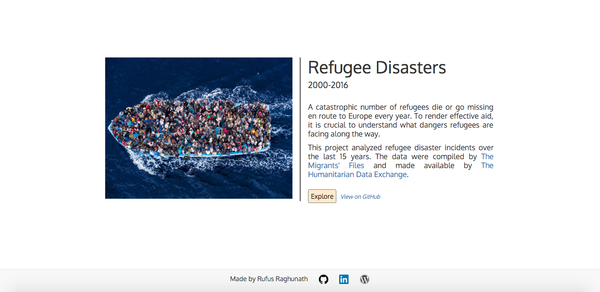
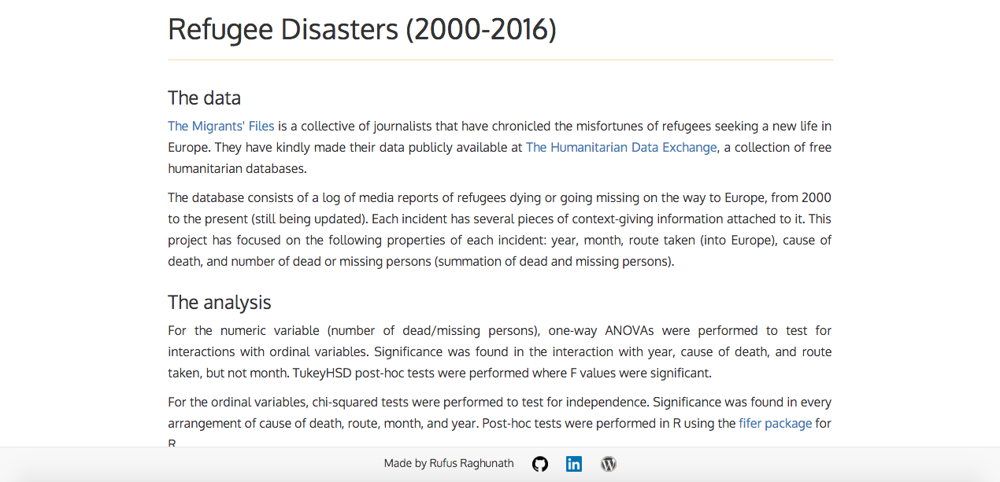
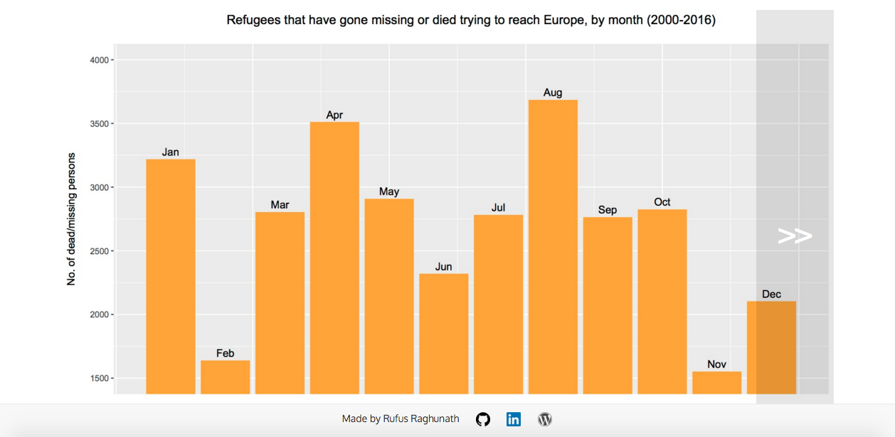

#Refugee Disasters 2000-2016
###Using R to understand the leading causes of death among refugees coming to Europe
#####Rufus Raghunath - Makers Academy week 06 (independent project)
Deployed to <a href="https://refugee-disasters.herokuapp.com/">Heroku</a> 26/02/2016

Recently, the public has become increasingly aware of the influx of refugees to Europe from various disaster-struck areas, particularly Syria. Many of those fleeing to the perceived safety of Europe have been met with yet more catastrophe. It is now more crucial than ever to understand what dangers refugees are encountering along the way, so as to be able to offer efficient aid.


##THE IDEA:
Lab week at Makers is a time to pursue our own interests and better our knowledge of coding in a self-directed fashion. I was interested in combining my background in statistics with the power of R to produce some meaningful and relevant data analysis. I noticed that in their <a href="http://www.themigrantsfiles.com/"> presentation of refugees dying or going missing on the way to Europe</a>, The Migrants' Files only covered locations of catastrophe, but did not provide analysis of the most common causes of death, the most dangerous times of the year, or the most dangerous routes into Europe. However, this information is critical if further disasters are to be averted. Happily, their data are <a href="https://data.hdx.rwlabs.org/dataset/refugee-and-migrant-deaths-while-trying-to-reach-europe/resource/bea9c0fa-51b2-4961-859f-cf22b2c09999">publicly available</a> via The Humanitarian Data Exchange, and so I decided to learn R by doing something useful with it.


##APPROACH:
Data were cleaned in Excel, then imported into R in ```.csv``` format. Basic descriptive statistics (mean, median, mode) were calculated (see ```desc_stats.txt```). Since R does not seem to offer a native function for calculating mode, I used this workaround: ```names(sort(-table(data)))[1]```.

Variables were sorted into numeric/quantitative (number of persons ```dead_or_missing``` per recorded incident) and ordinal (```year```, ```month```, ```cause_of_death```, and ```route``` of travel into Europe).

For the numeric variable, one-way ANOVAs were performed to test for interactions with ordinal variables. Significance was found in the interaction with ```year```, ```cause_of_death```, and ```route``` (still needs to be adjusted for total number of refugees traveling per route), but not ```month```.

For the ordinal variables, chi-squared tests were performed to test for independence. Significance was found in every arrangement of ```cause_of_death```, ```route```, ```month```, and ```year```.

For each route, the total number of illegal entrants in 2015 was added to the number of persons who died or went missing on that route in 2015 (d), giving the total number of persons who attempted to make the journey (j). The percentage mortality rate (m) for that route was calculated using m = (d/j)*100.

For the stats details, see ```/anova``` and ```/chisq```.


##CONCLUSIONS:
Overall fatalities are increasing and the highest-risk group are refugees traveling into Europe by sea in January. Maritime entry into Europe is especially dangerous (e.g. Western African Route, Central Mediterranean Route). Drowning and exhaustion account for the vast majority of refugee disaster incidents.

See ```conclusions.md``` for more.


##TECHNOLOGIES USED:
- R
- Ruby
- Sinatra
- Bootstrap
- HTML/CSS
- jQuery


##ACKNOWLEDGEMENTS:
Thanks to <a href="https://data.hdx.rwlabs.org/">The Humanitarian Data Exchange</a> and <a href="http://www.themigrantsfiles.com/">The Migrants' Files</a> for making this data available.

The image of the refugee boat on the index page is from http://www.iamsyria.org/teaching-about-the-refugee-crisis-and-making-a-difference.html.

Idea for jQuery image slider from http://imageslidermaker.com/blog/how-to-make-a-responsive-image-slider-using-jquery-and-css.

Thanks to <a href='https://github.com/shadchnev'>Evgeny Shadchnev</a> for some CSS help.


##HOW TO USE:
Get started by visiting https://refugee-disasters.herokuapp.com/. You will be greeted with the home/summary screen:



Click the 'Explore' button to view the results of the analysis:



There are 7 graphical representations (plots) of the results in total and they are presented in the common 'image slider' format. Click on the left or right side of the currently displayed graph to move to the next/previous image:



